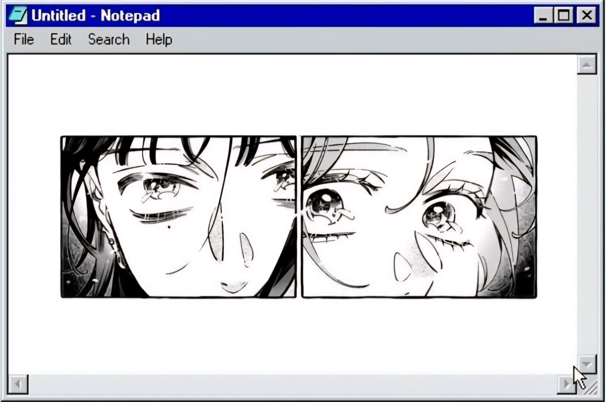

<!DOCTYPE html>
<html lang="es">
<head>
<meta charset="UTF-8">
<meta name="viewport" content="width=device-width, initial-scale=1.0">
<title>Unclick</title>

</head>

<body>

  
  
  
  
  
  
  
  

</body>
</html>

